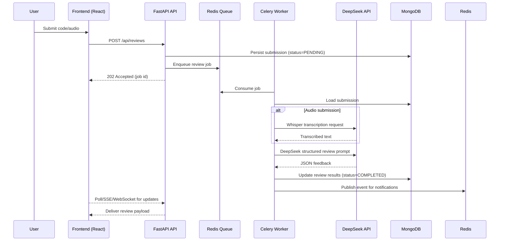

# DeepReview Architecture

This document summarizes the architecture choices captured in `project_plan.md` and serves as a living reference for the engineering team.

## Topology Overview
- **Frontend:** React + TypeScript SPA (Vite) hosted on Vercel, consuming the FastAPI backend.
- **API Layer:** FastAPI modular monolith deployed to Render (primary) with Railway fallback.
- **Background Processing:** Celery workers triggered from API requests, orchestrated through Upstash Redis, performing AI review jobs.
- **Datastores:** MongoDB Atlas (M0) for submissions and review data; optional GridFS for large payloads.
- **AI Providers:** DeepSeek (primary) and WhisperAPI (audio transcription). Optional OpenAI fallback.
- **Observability:** Sentry, Grafana Cloud, UptimeRobot, Logtail/Axiom.

```mermaid
graph TD
	A[Web Client (Vercel)] -->|HTTPS| B[FastAPI API Gateway]
	B -->|Async Task| C[Celery Worker]
	B -->|CRUD| D[(MongoDB Atlas)]
	B -->|Cache/Rate Limit| E[(Upstash Redis)]
	C -->|Prompt| F{{DeepSeek API}}
	C -->|Transcribe| G{{Whisper API}}
	B -->|Metrics & Traces| H[(Sentry / Grafana)]
	C -->|Events| I[WebSocket/Notification Layer]
	B -->|Static Assets| J[Vercel CDN]
```

## Bounded Contexts
1. **Submission Context:** Handles code/audio intake, validation, and creation of work items.
2. **Review Context:** Orchestrates AI prompts, persists structured feedback, and tracks job status.
3. **Analytics Context:** Aggregates review metrics, exposes `/api/stats`, and powers dashboard queries.
4. **Notification Context:** Publishes events for WebSockets, email/Slack (future), and rate-limit alerts.

## Modular Monolith Rationale
- Single deployable service fits free-tier quotas and reduces operational overhead.
- Clear folder boundaries (`app/api`, `app/services`, `app/models`) mimic microservice domain separation.
- Celery workers isolate long-running tasks, enabling future extraction into services when scale requires.

## Key Patterns & Practices
- **Hexagonal Architecture:** Ports & adapters for MongoDB repositories, AI providers, and cache clients.
- **CQRS-lite:** Analytics read models generated via scheduled tasks, separated from write models.
- **Event-Driven Extensions:** Domain events raised from service layer feed Celery tasks and WebSocket notifications.
- **Feature Flags:** GrowthBook integrates via backend middleware and React hooks.

## Data Flow Snapshot
1. User submits code (or audio) from frontend.
2. API stores submission in MongoDB, enqueues Celery task.
3. Worker fetches submission, calls WhisperAPI (if audio) and DeepSeek for analysis.
4. Feedback stored in `reviews`, events emitted for live updates.
5. Analytics job periodically aggregates metrics into `analytics_snapshots`.
6. Frontend dashboards query `/api/stats` and `/api/reviews` for insights.

### Sequence Diagram – Review Lifecycle



## Deployment Matrix

| Component            | Runtime Image            | Deployment Target | Scaling Strategy                | Free-Tier Notes |
|----------------------|--------------------------|-------------------|---------------------------------|-----------------|
| Frontend SPA         | Node 20, Vite build      | Vercel Hobby      | Vercel auto-scale (edges)       | Unlimited builds |
| API (FastAPI)        | Python 3.11, Uvicorn     | Render Web Service| Manual scale to 1 instance      | 750 hrs/mo       |
| Celery Worker        | Python 3.11, Celery      | Render Worker     | Concurrency via `--concurrency` | Suspend on idle  |
| Redis (Broker/cache) | Managed Upstash Redis    | Upstash Cloud     | Single free instance            | 10k req/day      |
| MongoDB Atlas        | Managed MongoDB Atlas M0 | Atlas Cloud       | Manual upgrade when needed      | 512 MB storage   |
| Monitoring           | Sentry, Grafana Cloud    | SaaS              | Alerts via webhooks             | Free plan limits |

## Infrastructure Footprint

- **Networking:** All services terminate TLS via hosting providers (Vercel/Render). Internal calls use HTTPS with API keys.
- **Secrets:** Stored in GitHub Environments (staging/prod) and synced to Render/Vercel through their secret managers.
- **CI/CD:** GitHub Actions orchestrates lint, tests, and deploy hooks. Backend deploy must succeed before frontend rollout.
- **Local Development:** Docker Compose spins up MongoDB, Redis, API, worker, and frontend for an end-to-end sandbox.
- **Disaster Recovery:** MongoDB Atlas backups (continuous) and Render automatic rollback. Documented runbook in `operations-runbook.md`.

## Security Considerations
- SlowAPI rate limiting with Redis backend.
- Secrets sourced from Doppler/GitHub and rotated quarterly.
- GitGuardian scanning and dependency audits enforced in CI.
- Request validation with Pydantic v2 and React Hook Form + Zod on the client.

## Deployment Pipeline Summary
- GitHub Actions run lint/test/audit on PRs.
- Merges to `main` trigger backend deployment to Render (deploy hook) and worker restarts.
- Successful backend deploy triggers frontend build/deploy on Vercel.

Refer to `docs/operations-runbook.md` for operational procedures and `docs/api-reference.md` for endpoint-level details.
